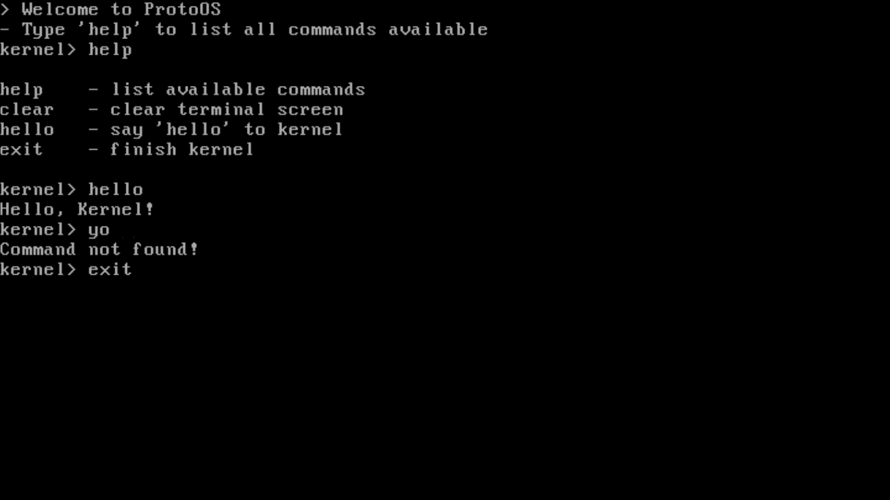

# :computer: ProtoOS

**OBSERVAÇÃO: ESTE PROJETO AINDA NÃO FOI CONCLUÍDO!**

ProtoOS é um mini sistema operacional desenvolvido em uma semana, inteiramente em Assembly 8086, que opera no modo real da CPU. Este projeto foi criado como parte de um trabalho sobre Sistemas Operacionais para minha faculdade.

---

## Requisistos

Para compilar o ProtoOS, você precisará dos seguintes comandos:

* **nasm**
* **make**
* **qemu**

---

## Executando

Após instalar todos os comandos nescessários, execute:

```sh
make all # Compila e executa
```

Este comando irá criar um novo diretório, na raiz do projeto, chamado **/build**. Nele, irá conter todos os arquivos compilados e a imagem do sistema.

Para limpar este diretório, execute:
```sh
make clean # Remove todos os arquivos do diretório /build
```

---

## Imagens



---

## :bookmark: Referências

Segue abaixo alguns links que me ajudaram a desenvolver este projeto.

### OSDev

* https://wiki.osdev.org
* https://wiki.osdev.org/Boot_Sequence
* https://wiki.osdev.org/Rolling_Your_Own_Bootloader
* https://wiki.osdev.org/Real_Mode
* https://wiki.osdev.org/Segmentation
* https://wiki.osdev.org/Memory_Map_(x86)

### Outros

* https://stanislavs.org/helppc
* https://thejat.in/learn/barebone-loading-kernel-in-asm
* https://github.com/gurugio/book_assembly_8086


### Videos

* [Building an OS](https://www.youtube.com/playlist?list=PLFjM7v6KGMpiH2G-kT781ByCNC_0pKpPN) by nanobyte
* [Desenvolvimento de Sistemas Operacionais](https://www.youtube.com/playlist?list=PLsoiO2Be-2z8BfsSkspJfDiuKeC9-LSca) by KiddieOS